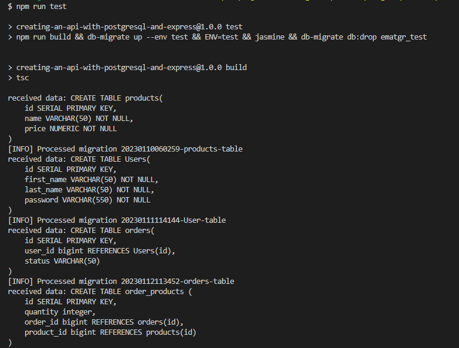
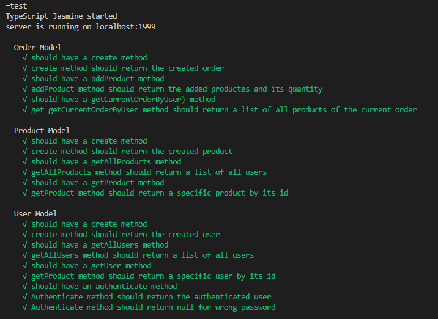

# Build a RESTful Node API for an E-Commerce website and JWT Authentication using Node, Express, Typescript, Jasmine and Postgres
The company stakeholders wanted to create an online storefront to showcase their great product ideas. Users need to be able to browse an index of all products, see the specifics of a single product, and add products to an order that they can view in a cart page. I've been tasked with architecting the database, building the API that will support this application, keeping user information secure, and providing user authentication tokens that are ready to integrate with the frontend

So i built a Node JS application that connects to Postgres (SQL) database. The database is used to store users’ details in order for them to log on to the application using JWT


# Technologies / Tools  
- Typescript
- Express JS
- Postgres SQL
- Thunder Client / Postman
- Jasmine
- Prettier
- Es-lint 
- Bcrypt
- Json Web Token (JWT)

# Installation
1. After clonning this repo, install the node_modules.
```bash
npm install
```
2. In psql, run the following to create the dev and test database.
```bash
 CREATE DATABASE ematgr;
 CREATE DATABASE ematgr_test;
 ```
3. Set the following Environment Variables in a ```.env``` file:
```
PORT=1999
ENV='dev'
POSTGRES_HOST=localhost
POSTGRES_USER=×××  //fill it with your postgres user name
POSTGRES_PASSWORD=××× //fill it with own postgres password
POSTGRES_PORT=××× //fill it with your postgres port
POSTGRES_DB=ematgr
POSTGRES_DB_TEST=ematgr_test
BCRYPT_PASSWORD=×××
SALT_ROUNDS=×××
TOKEN_SECRET=×××
```
4. Navigate to the root directory and run the following command to migrate the database
```bash
db-migrate up
 ```
5. Start the api in dev mode.
    - the server will start on port 1999
```bash
npm run dev
 ```


# Steps to build a RESTful API in Nodejs for an online store, JWT Authentication and how i met the project requirements
## 1. Setup the project and configure TypeScript
- At first, I initialized the project
    ```bash
    npm init -y
    ```
    ```bash
    npm i typescript --save-dev 
    ./node_modules/.bin/tsc --init
    ```
    ```bash
    npm i nodemon node-ts --save-dev 
    ```
- , Wrote scripts in package.json for nodemon library ,compile and run the server
    ```json
    "scripts": {
        "dev": "nodemon src/index.ts",
        "build": "tsc",
        "start": "npm run build && node dist/index.js"
    }
    ```
- , Configured Es-lint + Prettier
    ```bash
    npm i prettier --save-dev 
    npm i eslint --save-dev 
    npx eslint --init
    npm i eslint-config-prettier eslint-plugin-prettier --save-dev 
    ```
- , Wrote scripts in package.json for formatting
    ```json
    "scripts": {
        "format": "prettier --write src/**/*.ts",
        "lint": "eslint src/**/*.ts",
        "lint:fix": "eslint src/**/*.ts --fix"
    }
    ```

- , Installed Express for starting the server :
    ```bash
    npm i express
    npm i @types/express --save-dev
    ```
## 2. Setup database :
- I set up two databases, one for development and the other for testing, So in psql, i run the following to create the dev and test databases :
    ```bash
    CREATE DATABASE ematgr
    CREATE DATABASE ematgr_test
    ```
- Set database Environment Variables to ```.env``` file -which is added to .gitignore file- and configured those secrets in config.ts file
    ```
    npm i dotenv --save-dev
    ```
    ```
    PORT=1999
    ENV='dev'
    POSTGRES_HOST=localhost
    POSTGRES_USER=postgres
    POSTGRES_PASSWORD=×××× //secret
    POSTGRES_PORT=1990
    POSTGRES_DB=ematgr
    POSTGRES_DB_TEST=ematgr_test
    ```

- ### Connected Node to a Postgres Database 
    ```bash
        npm i pg
        npm i @types/pg --save-dev
    ```
    - Connected Pooling in PostgresSQL with Express JS by creating as instance of Pool


    
- ### Migrated database
    - Installed db-migrate
    ```bash
    npm i db-migrate
    npm i @types/db-migrate --save-dev
    ```
    - Create database.json for Environment setting to be loaded from it
    - Created database schema to meet the project requirements
    ```bash
    db-migrate create products-table --sql-file
    db-migrate create users-table --sql-file
    db-migrate create orders-table --sql-file
    db-migrate create order-products-table --sql-file
    ```
 - ### Data Shapes
    - Product
        - id
        - name
        - price
    ```
    TABLE products(
    id SERIAL PRIMARY KEY,
    name VARCHAR(50) NOT NULL,
    price NUMERIC NOT NULL)
    ```
    - User
        - id
        - first_name
        - last_name
        - password
    ```
    TABLE users(
    id SERIAL PRIMARY KEY,
    first_name VARCHAR(50) NOT NULL,
    last_name VARCHAR(50) NOT NULL,
    password VARCHAR(550) NOT NULL)
    ```
    - Order 
        - id
        - user_id
        - status of order (active & complete)
    ```
    TABLE orders(
    id SERIAL PRIMARY KEY,
    user_id bigint REFERENCES Users(id),
    status VARCHAR(50))
    ```
    - Order Products ```(relational table with foreign keys to users table and products table)```
    ```
    TABLE order_products (
    id SERIAL PRIMARY KEY,
    quantity integer,
    order_id bigint REFERENCES orders(id),
    product_id bigint REFERENCES products(id))
    ```

    - run db-migrate up to migrate to the dev database
    ```bush
    db-migrate up
    ```
    
    
- Created CRUD models for (users, products, orders (& order-products)) tables
## 3. Created API Routes and Endpoints
- Product
    - Index : ```.get('products/', controllers.getAllProducts)```
    - Show : ```.get('products/:id', controllers.getProduct)```
    - Create(args: Product)[token required] : ```.post('products/', verifyAuthToken, controllers.create)```
- User
    - Index[token required] : ```.get('users/', verifyAuthToken, controllers.getAllUsers);```
    - Show[token required] : ```.get('users/:id', verifyAuthToken, controllers.getUser)```
    - Create(args: User)[token required] : ```.post('users/', verifyAuthToken, controllers.create)```
    - Delete[token required] : ```.delete('users/:id', verifyAuthToken, controllers.deleteUser)```
- Order
    - Current order by the user(args: User id)[token required] : ```.get('orders/current',verifyAuthToken,controllers.getCurrentOrderByUser)```
    - Completed order by the user[token required] : ```get('orders/completed', controllers.completedOrdersByUser)```

## 4. Secured user password with password hashing, pepper, and salt and valideted it using Bcrypt.
    ```bush
    npm i bcrypt
    npm i @types/bcrypt --save-dev
    ```
- added ```BCRYPT_PASSWORD``` and ```SALT_ROUNDS``` to Environment Variables
- in User model hashed password to creat a new user method
    ```
      const hash = bcrypt.hashSync((u.password + config.pepper) as string, parseInt(config.salt as string, 10));
    ```
## 5. Verifed Authenticated User (Login process) with generating a JWT token
- Compared the login password with the registered user password
    ```
    bcrypt.compareSync((password + config.pepper) as string, result.rows[0].password)
    ```
- Installed json web token 
    ```bush
    npm i jsonwebtoken
    npm i @types/jsonwebtoken --save-dev
    ```
- added ```TOKEN_SECRET``` to Environment Variables
- Generated and add a JWT token (PAYLOAD + TOKEN_SECRET) to the authenticated users to be stored on the frontend and can be used for future authorizations with the API
    ```
    const token = jwt.sign({ user }, `${config.tokenSecret}`)
    ```
- ## Created validate-JWT authorization middleware
    - Check authorization header validate
    ```
    const authorizationHeader = req.headers.authorization;
    ```
    - Get value of token
    ```
    const token = authorizationHeader ? authorizationHeader.split(' ')[1] : '';
    ```
    - Decode based on token secret
    ```
    const decoded = jwt.verify(req.body.token, `${config.tokenSecret}`);
    ```
## 6. Created Unit Testing using Jasmine
- Installed Jasmine and the needed dependencies for the unit testing
    ```bash
    npm i supertest jasmine-spec-reporter jasmine
    ```
- the environment by default is set to "dev", so in package.json file,  i wrote a test script to set the ENV variable to "test" so that the testeing database is used instead of development database and all tables is migrated up to it during testing.
    ```json
    "scripts": {
        "test": "npm run build && db-migrate up --env test && ENV=test && jasmine && db-migrate db:drop ematgr_test"
    }
    ```
    

    
- After finishing testing, the database is dropped by this command in test script 
        ```
        db-migrate db:drop ematgr_test
        ```

# Testing 
Run test with : 
    ```
    npm run test
    ```

# Table of contents
- [Project Title](#build-a-restful-node-api-for-an-e-commerce-website-and-jwt-authentication-using-node-express-typescript-jasmine-and-postgres)
- [Technologies / Tools](#technologies--tools)
- [Installation](#installation)
- [Steps to build a RESTful API in Nodejs for an online store, JWT Authentication and how i met the project requirements](#steps-to-build-a-restful-api-in-nodejs-for-an-online-store-jwt-authentication-and-how-i-met-the-project-requirements)
- [Testing](#testing)


